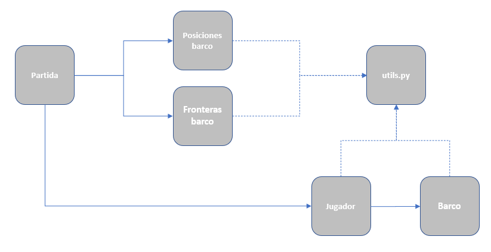
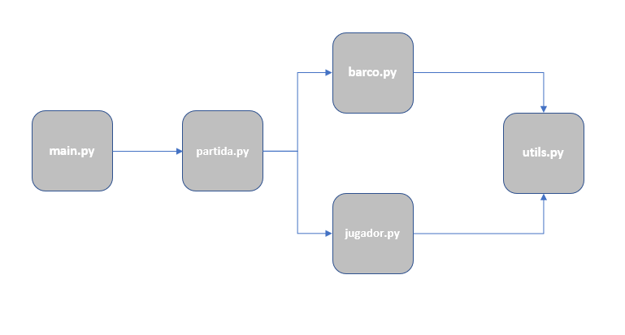

# Hundir la Flota 
*Autores:* 
*Ana Genua* 
*Federico Ruiz* 
 
Este proyecto se ha desarrollado usando Python 3.7 y en el mismo se han empleado los siguientes módulos de la Standard Library de Python:
- os
- re
- pandas
- numpy
- random
- sys
- json
- copy
 

## Arquitectura de la aplicación. 
Hemos intentado crear una arquitectura orientada a objetos, aunque no ha sido necesario usar conceptos como la herencia, resultando el siguiente esquema: 
 
  

Propósito de cada clase:

- Partida: 
  - Almacenar los objetos jugador. 
  - Generar aleatoriamente los datos sobre las barcos.
  - Proporcionar los datos sobre los barcos para generar la flota de cada jugador.
  - Generar estadísticas sobre la partida.

- Jugagor:
  - Almacenar los datos sobre la flota.
  - Almacenar los datos sobre los disparos realizados.
  - Proporcionar métodos para realizar disparos.

- Barco:
  - Almacena la información de los daños y el estado de cada barco.
  - Proporciona un método para comprobar los daños provocados y el estado del barco.
 
No se ha implementado una clase Flota para almacenar los barcos; simplemente se han almacenado los objetos barco en una lista. 

Se han usado dos clases auxiliares: 
- Celdas barco
- Fronteras barco

Respectivamente se usan para, calcular las celdas que ocupará cada barco y las fronteras que tendrá cada barco. De esta forma al generar el tablero de cada jugador, evitamos que los barcos entren en conflicto. 

Adicionalmente existe un archivo utils.py donde se han ubicado funciones que serán usadas por los distintos objetos, para operaciones como: 
- Almacenar constantes
- Solicitar inputs del usuario
- Imprimir la pantalla de juego
- Generar valores random
- Traducir coordenadas

##  Esquema de archivos. 
Los archivos en los que se han implementado dichas clases están ubicados en el directorio **src** y se relacionan como muestra el siguiente gráfico: 

  

## Ejecución del programa.
Para iniciar el programa ejecutar el script ***main.py*** en el directorio *src*. 
  

Introducir el nombre del jugador A, el jugador B será controlado por el programa y siempre se llamará **Skynet...**  
  

Indicar el nivel de dificultad. 
 
En cualquiera de estos dos pasos, si no introducimos un valor, saldremos del programa.  

Al introducir el nivel de dificultad, sólo aceptará valores entre 1 y 5. 
  

Se nos dará la bienvenida y se nos pedirá confirmación para comenzar la partida. 
  

En la pantalla de juego se nos muestran dos áreas, una superior con la ubicación de nuestros barcos y una inferior con los disparos que hemos realizado y su resultado. 
  

El sistema controla que las coordenadas del disparo tienen el formato correcto. En caso contrario no son aceptadas. 
  

Podemos salir de la partida en todo momento, introduciendo el mensaje indicado. 
  

El resultado de nuestro primer disparo, se nos mostrará antes de pasar al turno de Skynet. 
  

Al finalizar el turno se nos mostrará el estado de nuestra flota, indicando los aciertos del enemigo. 
  

Cuando uno de los jugadores destruya la flota completa del contrario, la partida finalizará. 
  

Por último se nos mostrará un listado de los disparos de cada uno de los contrincantes y un resumen de los mismos. 
  
